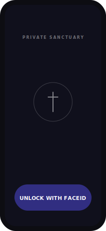
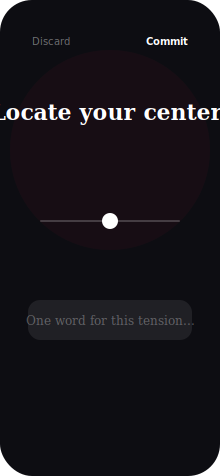
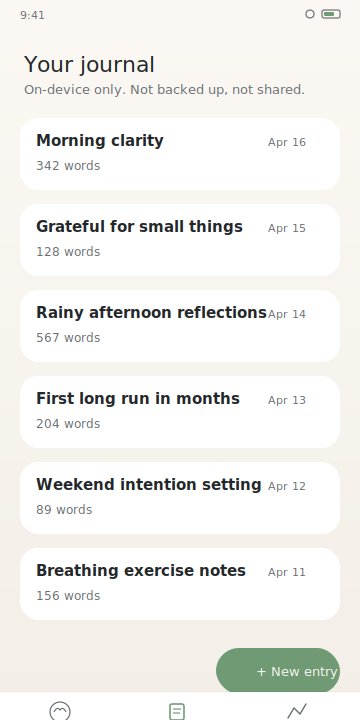
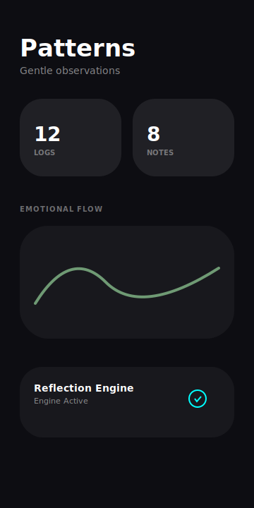

# Wellness Companion (iOS)

A premium, private, and offline-first "Wellness and Mental Health Companion" for iOS,
built with **Swift + SwiftUI** and engineered to match the standards of high-end
wellness applications like Calm and Headspace.

## Screenshots

<p align="center">
  
  &nbsp;&nbsp;
  
</p>
<p align="center">
  
  &nbsp;&nbsp;
  
</p>
<p align="center">
  <sub>
    Sanctuary Gate &nbsp;·&nbsp; Liquid Mood Wheel &nbsp;·&nbsp; Reflections Timeline &nbsp;·&nbsp; Pulse Dashboard
  </sub>
</p>

## Features

- **Liquid Mood Wheel** — high-fidelity, circular interaction model that captures valence and energy with a single, tactile gesture.
- **Atmospheric Motion** — cinema-grade background with drifting, animated gradients for a serene and immersive experience.
- **Reflection Sparks** — AI-powered prompts that adapt to your recent mood and time of day to trigger deeper journaling.
- **Focus-First Journaling** — a minimalist typewriter-style editor that prioritizes content and emotional flow.
- **Biometric Sanctuary Gate** — local FaceID/TouchID unlock to ensure absolute privacy for your personal reflections.
- **Liquid Glass Aesthetic** — a borderless, immersive interface leveraging heavy glassmorphism and dynamic dark themes.

## Architecture

- **Clean Architecture**: Decoupled Domain, Data, and UI layers for high maintainability.
- **Offline Intelligence**: Integration with `llama.cpp` for completely private on-device AI reflections.
- **Local Persistence**: High-performance SQLite backing for 100k+ local records.
- **Fluent UX**: Pure SwiftUI implementation using `Canvas` for world-class rendering performance.

## Prerequisites

- **macOS** (latest recommended)
- **Xcode** 15.0+
- **XcodeGen** (for project generation)

## Building & Running

1. **Install XcodeGen**
   ```bash
   brew install xcodegen
   ```

2. **Generate and Build**
   Navigate to the `ios/` directory:
   ```bash
   xcodegen generate
   xcodebuild build -project WellnessCompanion.xcodeproj -scheme WellnessCompanion -destination 'platform=iOS Simulator,name=iPhone 17'
   ```

